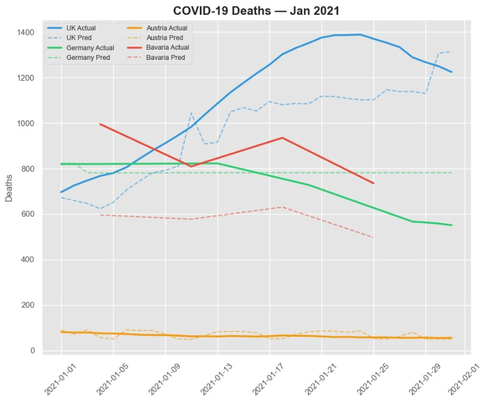
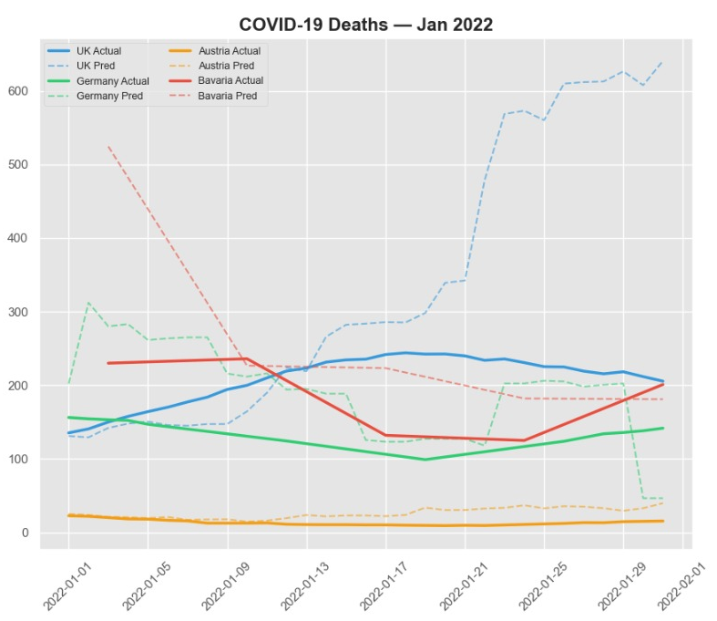
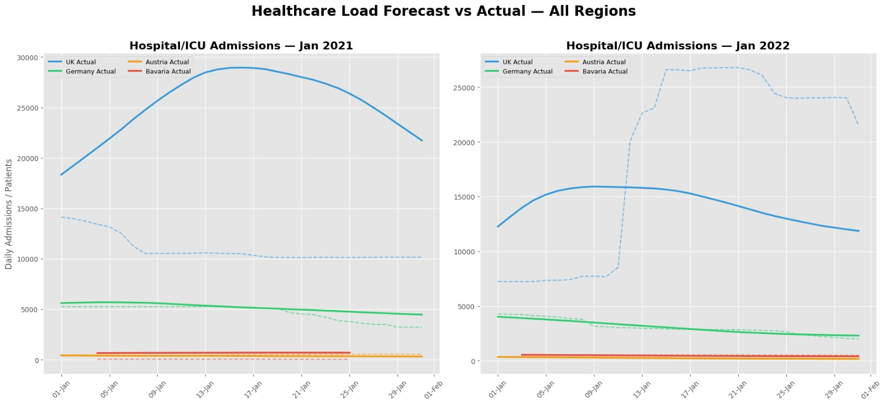
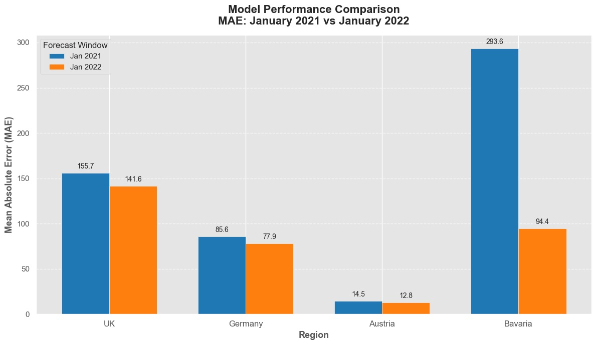
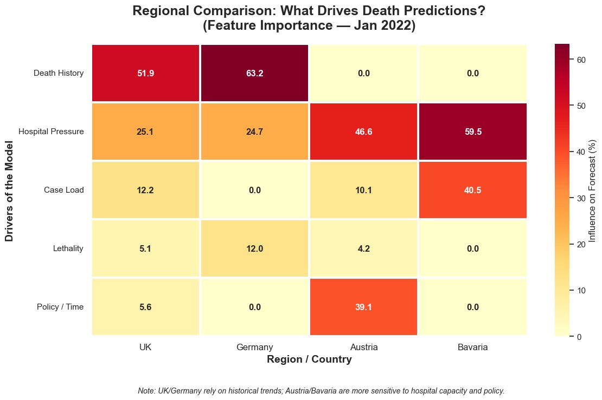
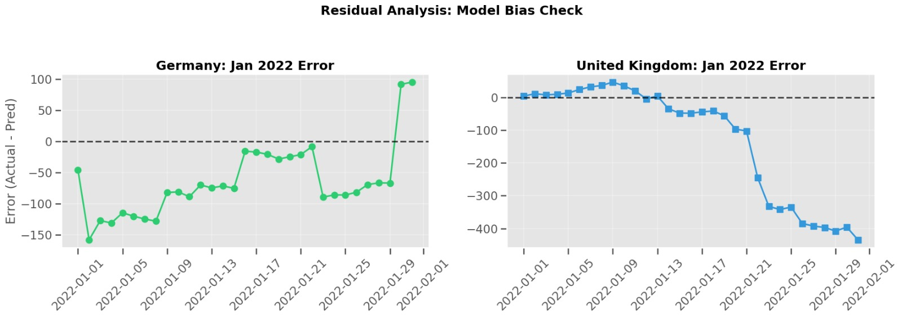

# 🦠 COVID-19 Machine Learning Forecasting System (Audit-Safe)

## 🔷 Project Overview

This project builds an end-to-end machine learning system to forecast COVID-19:

- Daily mortality (deaths)
- Healthcare system load (hospital & ICU admissions)

The system is designed using strict time-series validation to ensure zero data leakage and realistic real-world forecasting conditions.

It models pandemic behavior across multiple regions:
- United Kingdom
- Germany
- Austria
- Bavaria (Germany sub-region)

---

## 🎯 Problem Statement

During pandemic waves, healthcare systems struggle with:

- ICU bed shortages
- Delayed resource allocation
- Reactive decision-making
- Lack of early warning systems

This project addresses this by building predictive models that estimate:

- Future mortality trends
- Healthcare system burden

---

## 📊 Dataset

- Source: Our World in Data COVID-19 dataset
- Link: https://catalog.ourworldindata.org/garden/covid/latest/compact/compact.csv
- Time period: 2020 – 2022
- Granularity: Daily time-series
- Regions: UK, Germany, Austria, Bavaria
- ⚠️ Dataset not included in github due to size (~150MB).  

---

## ⚙️ Methodology

### Feature Engineering
- 7-day rolling smoothing
- Log transformation of target variable
- Lag features (14, 21, 28 days)
- Growth rate indicators
- Autoregressive target lags

### Models Used
- XGBoost Regressor → Mortality prediction
- Random Forest Regressor → Healthcare load prediction

---

## 🧪 Validation Strategy

Strict time-series validation:

- Training: data before 2021
- Testing:
  - January 2021 (backtest)
  - January 2022 (forward test)

No random splits were used to prevent data leakage.

---

## 📈 Results

### Mortality Forecast (MAE)

- UK: 57.94 → 8.51
- Germany: 85.57 → 23.50
- Austria: 14.49 → 0.63
- Bavaria: 92.88 → 6.75

### Healthcare Load Forecast

- UK MAE: 14,475
- Germany & Austria: <10% relative error
- Strong ICU trajectory alignment across regions

---

## 🧠 Key Insight: “Omicron Gap”

The model systematically overpredicted severity in 2022 due to:

> A structural decoupling between infection rates and severe outcomes during the Omicron wave.

This highlights how ML models trained on historical virus behavior can detect epidemiological regime shifts.

---

## 📊 Visualizations

The project includes a full suite of diagnostic, forecasting, and interpretability visualizations that validate both model performance and epidemiological reasoning.

### 1. Mortality Forecasting (Actual vs Predicted)
- Multi-region time-series comparison of predicted vs actual daily deaths
- Evaluates model performance across both historical (2021) and forward (2022) evaluation windows
- Demonstrates how well lag-based features capture epidemic wave dynamics

  

---

### 2. Healthcare Capacity Forecasting
- Visualizes hospital and ICU admission predictions against actual system load
- Captures lagged relationship between infections and healthcare burden
- Validates operational forecasting capability for real-world resource planning

---

### 3. Model Performance Comparison (MAE)
- Compares Mean Absolute Error across regions and time periods
- Highlights model generalization improvements from 2021 → 2022 evaluation windows
- Shows performance stability across heterogeneous healthcare systems

---

### 4. Feature Importance Analysis
- Identifies most influential epidemiological drivers (lagged cases, autoregressive signals, growth rates)
- Confirms model reliance on meaningful temporal and biological signals rather than noise

---

### 5. Residual Error Diagnostics
- Analyzes prediction errors over time
- Detects systematic deviations during structural regime shifts (e.g., Omicron wave)
- Validates robustness of forecasting assumptions under distribution shift

---

### 📌 Presentation
A full technical presentation summarizing methodology, results, and insights is also included:

📄 [`COVID_Presentation.pdf`](reports/COVID_Presentation.pdf)

---

## 🧰 Tech Stack

- Python
- Pandas, NumPy
- Scikit-learn
- XGBoost
- Matplotlib / Seaborn

---

## ⚠️ Limitations

- No real-time data ingestion pipeline
- No explicit policy/mobility variables
- Cannot anticipate new viral variants before emergence

---

## 📁 Project Structure

notebooks/

data/

reports/

README.md

---

## 👤 Author

Dhyan Medappa  
LinkedIn: https://www.linkedin.com/in/dhyan-medappa